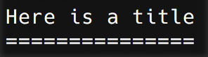
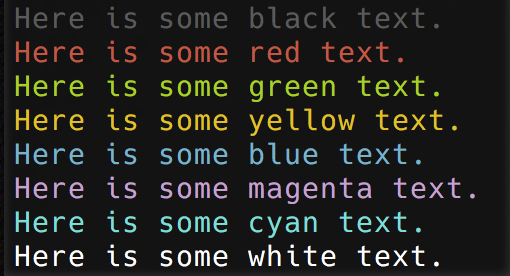
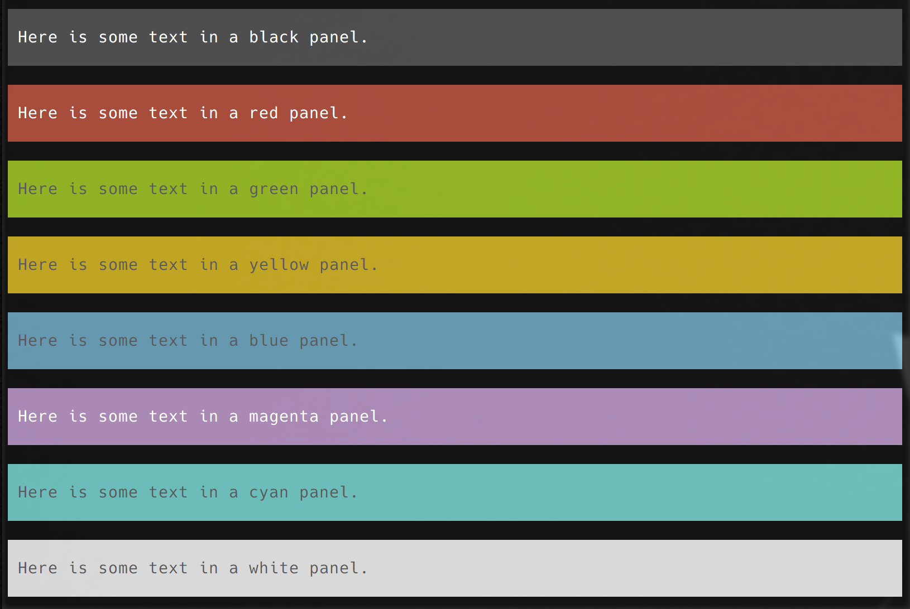
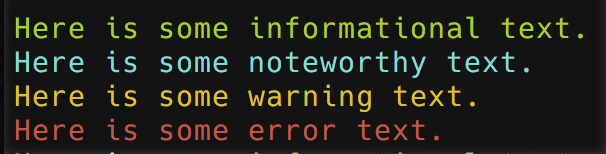
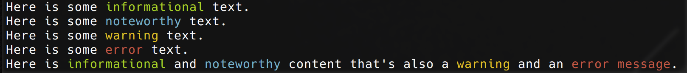
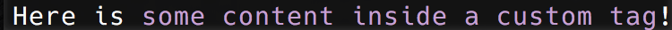
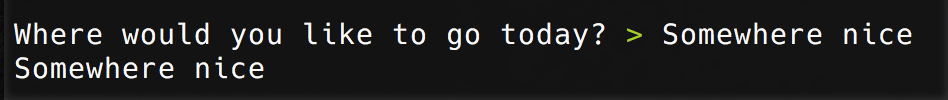

[](https://travis-ci.org/Brunty/go-console) [](https://coveralls.io/github/Brunty/go-console) [](https://goreportcard.com/report/github.com/brunty/go-console)

Learning some Go, writing a library to make console output pretty - starting with colors.


## Installation

`go get github.com/brunty/go-console`

Import the package:

## Usage:

```go
import console "github.com/brunty/go-console"
```

## Methods for output

### Title

```go
console.Title("Here is a title")
```



### Colored text:
```go
console.Black("Here is some black text.")
console.Red("Here is some red text.")
console.Green("Here is some green text.")
console.Yellow("Here is some yellow text.")
console.Blue("Here is some blue text.")
console.Magenta("Here is some magenta text.")
console.Cyan("Here is some cyan text.")
console.White("Here is some white text.")
```



### Colored panels: (CURRENTLY VERY EXPERIMENTAL)
```go
console.BlackPanel("Here is some text in a black panel.")
console.RedPanel("Here is some text in a red panel.")
console.GreenPanel("Here is some text in a green panel.")
console.YellowPanel("Here is some text in a yellow panel.")
console.BluePanel("Here is some text in a blue panel.")
console.MagentaPanel("Here is some text in a magenta panel.")
console.CyanPanel("Here is some text in a cyan panel.")
console.WhitePanel("Here is some text in a white panel.")
```



### Helper output methods:
```go
console.Info("Here is some informational text.")
console.Note("Here is some noteworthy text.")
console.Warning("Here is some warning text.")
console.Error("Here is some error text.")
```



### Output with markup:
```go
console.WriteLn("Here is some <info>informational</info> text.")
console.WriteLn("Here is some <note>noteworthy</note> text.")
console.WriteLn("Here is some <warning>warning</warning> text.")
console.WriteLn("Here is some <error>error</error> text.")
console.WriteLn("Here is <info>informational</info> and <note>noteworthy</note> content that's also a <warning>warning</warning> and an <error>error message</error>.")
```



### Adding your own custom tags:
```go
console.AddStyle("mytag", "magenta")
console.WriteLn("Here is <mytag>some content inside a custom tag</>!")
```



## Methods for input

### Asking questions:

```go
answer, _ := console.Question("Where would you like to go today?")

console.WriteLn(answer)
```



This will wait for input before continuing on with the program.
